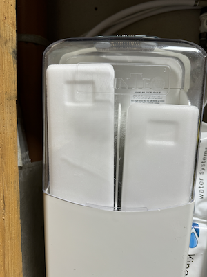
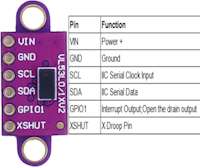
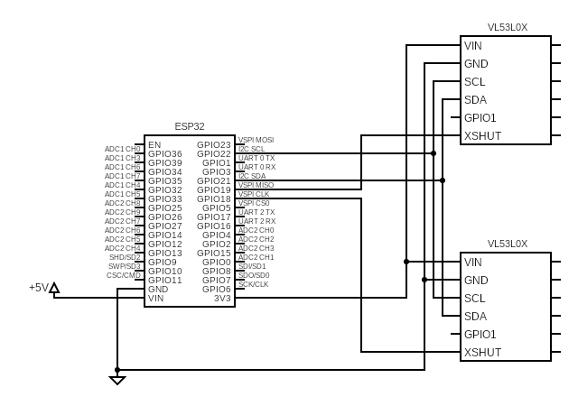
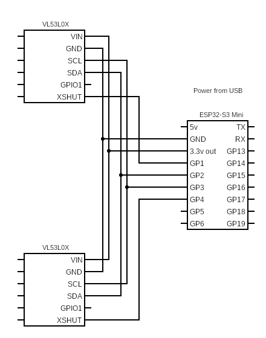
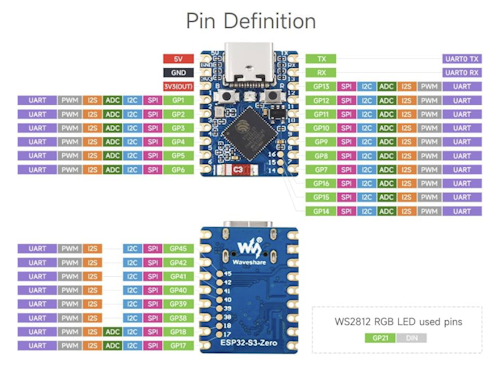

# ESPHome Water softener blocksalt level detector

Inspired by 'Water Softener Salt Level Monitor' <https://www.instructables.com/Water-Softener-Salt-Level-Monitor/>.

This is deigned to work with the Kinetico Water Softeners that work with salt blocks, in particular the model I have has a clear cover so the salt level can be measured without modifying the cover.

NOTE: this is still work in progress. Currently testing final version. 

DUBEUYEW VL53L0X Time-of-Flight Distance Sensor Flight Measurement ToF Laser Range Finder 940nm Laser Detect Module for Arduino
<https://www.amazon.co.uk/dp/B0BXKD5Z4H>

## ESPHome Solution

Solution was to use a time-of-flight sensor above each salt block and link that to ESPHome running on Home Assistant.

<https://esphome.io/components/sensor/vl53l0x.html>

### Prototype ESP32 WROOM

| ESP32 Pin | Name    | VL53L0X Left | VL53L0X Right |
| --------- | ------- | ------------ | ------------- |
| 19        | Vin 5v  |              |               |
| 38        | GND     |              |               |
| -         |         |              |               |
| 1         | 3.3v    | VIN          |               |
|           |         | GND          |               |
| 36        | GPIO22  | SCL          |               |
| 33        | GPIO21  | SDA          |               |
|           | -       | GPIO1        |               |
| 31        | GPIO19  | XSHUT        |               |
| -         |         |              |               |
| 1         | 3.3v    |              | VIN           |
|           |         |              | GND           |
| 36        | GPIO22  |              | SCL           |
| 33        | GPIO21  |              | SDA           |
|           | -       |              | GPIO1         |
| 30        | GPIO18  |              | XSHUT         |

## Final Solution - ESP32-S3 Mini

Waveshare ESP32-S3 Mini Development Board
<https://www.amazon.co.uk/dp/B0CHYHGYRH>

| ESP32-S3 Mini Pin | Name    | VL53L0X Left | VL53L0X Right |
| --------- | ------- | ------------ | ------------- |
| 1         | Vin 5v  |              |               |
| 2         | GND     |              |               |
| -         |         |              |               |
| 3         | 3.3v    | VIN          |               |
|           |         | GND          |               |
| 6         | GPIO22  | SCL          |               |
| 5         | GPIO21  | SDA          |               |
|           | -       | GPIO1        |               |
| 7         | GPIO19  | XSHUT        |               |
| -         |         |              |               |
| 3         | 3.3v    |              | VIN           |
|           |         |              | GND           |
| 6         | GPIO22  |              | SCL           |
| 5         | GPIO21  |              | SDA           |
|           | -       |              | GPIO1         |
| 4         | GPIO18  |              | XSHUT         |

### Circuit board

